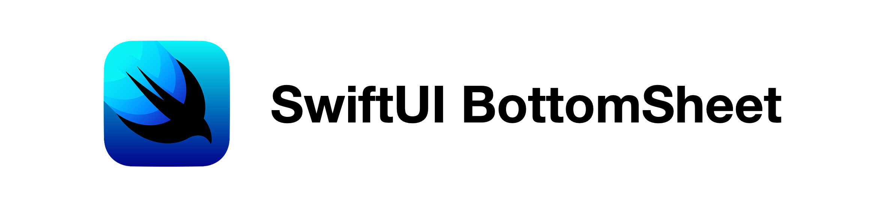

======================================

[](https://github.com/LucasMucGH/BottomSheet/releases)
[](https://github.com/LucasMucGH/BottomSheet/blob/main/LICENSE)
[](https://github.com/LucasMucGH/BottomSheet/issues)

A sliding Sheet from the bottom of the Screen with 3 States build with SwiftUI

- [Why](#why) 
- [Requirements](#requirements) 
- [Installation](#installation)
- [Usage](#usage) 
- [Parameters](#parameters)
- [Examples](#examples)
- [Contributing](#contributing)
- [License](#license)
- [Credits](#credits)

# Why

There have been many different attempts to recreate the BottomSheet from Apple Maps, Shortcuts and Apple Music, because Apple unfortunately does not provide it in their SDK.

However, all previous attempts have a common problem: The **hight does not change** in the different states. Thus, the BottomSheet is always the same size (e.g. 800px) and thus remains 800px, even if you only see e.g. 400px - the rest is **inaccessible** unless you pull the BottomSheet up to the very top.

There are also many implementations out there that **only have 2 states** - **not 3** like e.g. Apple Maps.

Unfortunately, my implementation currently only supports 1 state (height cannot be changed) and 3 states (such as Apple - Top, Middle, Bottom (, Hidden)). But I'm working on a solution for 2 states.

#### Here are some alternatives:
- https://swiftwithmajid.com/2019/12/11/building-bottom-sheet-in-swiftui/
- https://gist.github.com/mecid/78eab34d05498d6c60ae0f162bfd81ee
- https://github.com/weitieda/bottom-sheet
- https://github.com/fernandodelafuente/BottomSheetModal

#### Here you can see the states mentioned above:


# Requirements 

- iOS 13
- Swift 5.3
- Xcode 12

# Installation

The preferred way of installing BottomSheet is via the [Swift Package Manager](https://swift.org/package-manager/).

>Xcode 11 integrates with libSwiftPM to provide support for iOS, watchOS, and tvOS platforms.

1. In Xcode, open your project and navigate to **File** → **Swift Packages** → **Add Package Dependency...**
2. Paste the repository URL (`https://github.com/LucasMucGH/BottomSheet`) and click **Next**.
3. For **Rules**, select **Branch** (with branch set to `main`).
4. Click **Finish**.

# Usage

## Basic Usage

**WARNING:**
This is Sample Code for visualisation where and how to use, without a working initializer. Please see [Examples](#examples) for working code

Same way you use Sheet in SwiftUI

````swift
struct ContentView: View {

    @State var bottomSheetPosition: BottomSheetPosition = .middle //1
    
    var body: some View {
    
        Map() //2
            .bottomSheet() //3
    }
}
````

`//1` This is where you store the current State of the BottomSheet
The following States are posible: `.hidden`, `.bottom`, `.middle` and `.top`.
If you don't want to be able to change the state, you can use `.constant(.hidden)` for Example (should  be used with `resizeable: false`).

`//2` This is the view you want the BottomSheet to overlay on

`//3` This is how you add the BottomSheet - easy right?

# Parameters

## Title as Header Content

**WARNING:**
This is Sample Code for visualisation of the parameters and their default values and value types, without a working initializer. Please see [Examples](#examples) for working code

````swift
.bottomSheet(
    bottomSheetPosition: Binding<BottomSheetPosition>,
    resizeable: Bool = true,
    showCancelButton: Bool = false,
    title: String? = nil,
    @ViewBuilder content: () -> mContent,
    closeAction: @escaping () -> () = {}
)
````

- `bottomSheetPosition`
  This is where you store the current State of the BottomSheet.
  The following States are posible: `.hidden`, `.bottom`, `.middle` and `.top`.
  If you don't want to be able to change the state, you can use `.constant(.hidden)` for Example (should  be used with `resizeable: false`).

- `resizeable`
  This parameter controls whether you can drag it.
  If `false`, the drag indicator disappears.
  
- `showCancelButton`
  Toggles the visibility of the Close (X) button.
  
- `title`
  The title of the BottomSheet.
  Can be `nil`.
  
- `content`
  Here you declare the view that should be inside of the BottomSheet.
    
- `closeAction`
  Here you declare the action that should be executed if you tap on the Close (X) button.
  IF YOU WANT SOMETHING TO HAPPEN YOU NEED TO DECLARE IT
  
  For Example
````swift
  {
   self.bottomSheetPosition = .hidden
  }
````

## Custom Header Content

**WARNING:**
This is Sample Code for visualisation of the parameters and their default values and value types, without a working initializer. Please see [Examples](#examples) for working code

````swift
.bottomSheet(
    bottomSheetPosition: Binding<BottomSheetPosition>,
    resizeable: Bool = true,
    showCancelButton: Bool = false,
    @ViewBuilder headerContent: () -> hContent?,
    @ViewBuilder mainContent: () -> mContent,
    closeAction: @escaping () -> () = {}
)
````

- `bottomSheetPosition`
  This is where you store the current State of the BottomSheet.
  The following States are posible: `.hidden`, `.bottom`, `.middle` and `.top`.
  If you don't want to be able to change the state, you can use `.constant(.hidden)` for Example (should  be used with `resizeable: false`).

- `resizeable`
  This parameter controls whether you can drag it.
  If `false`, the drag indicator disappears.
  
- `showCancelButton`
  Toggles the visibility of the Close (X) button.
  
- `headerContent`
  Here goes your Custom Header Content.
  Any view is possible - this can lead to problems if the views are too large. Label, a Small Image or Text is recommended.
  Can be `nil`.
  
- `mainContent`
  Here you declare the view that should be inside of the BottomSheet.
    
- `closeAction`
  Here you declare the action that should be executed if you tap on the Close (X) button.
  IF YOU WANT SOMETHING TO HAPPEN YOU NEED TO DECLARE IT
  
  For Example
````swift
  {
   self.bottomSheetPosition = .hidden
  }
````

# Examples

## The simplest Version of a BottomSheet

````swift
import SwiftUI
import BottomSheet

struct BottomSheetTest1: View {
    
    @State private var bottomSheetPosition: BottomSheetPosition = .middle
    
    var body: some View {
        ZStack {
            //A simple Black background
            Color.black
                .edgesIgnoringSafeArea(.all)
                
                .bottomSheet(bottomSheetPosition: self.$bottomSheetPosition, content: {
                    //The Numbers from 0 to 99 as Main Content in a Scroll View
                    ScrollView {
                        ForEach(0..<100) { index in
                            Text(String(index))
                        }
                        .frame(maxWidth: .infinity)
                    }
                    .padding(.top)
                })
        }
    }
}
````

## A not draggable, but dismissable Bottom Sheet to show aditional Information

````swift
import SwiftUI
import BottomSheet

struct BottomSheetTest2: View {
    
    @State private var bottomSheetPosition: BottomSheetPosition = .middle
    
    var body: some View {
        ZStack {
            //A simple Black background
            Color.black
                .edgesIgnoringSafeArea(.all)
                
                .bottomSheet(bottomSheetPosition: self.$bottomSheetPosition, resizeable: false, showCancelButton: true, title: "Hello World", content: {
                    //A Tag, with some sample Text and a Read More and Bookmark Button
                    VStack(alignment: .leading, spacing: nil) {
                        
                        Text("BottomSheet")
                            .foregroundColor(.white)
                            .bold()
                            .padding(8)
                            .background(Color.red)
                            .cornerRadius(10)
                            .padding(.horizontal)
                        
                        Divider().padding(10)
                        
                        Text("Lorem ipsum dolor sit amet, consectetur adipiscing elit, sed do eiusmod tempor incididunt ut labore et dolore magna aliqua. Ut enim ad minim veniam, quis nostrud exercitation ullamco laboris nisi ut aliquip ex ea commodo consequat.")
                            .fixedSize(horizontal: false, vertical: true)
                            .padding(.horizontal)
                        
                        Divider().padding(10)
                        
                        HStack {
                            Button(action: {}, label: {
                                Text("Read More")
                                    .foregroundColor(.white)
                            })
                            .padding(.vertical)
                            .padding(.horizontal, 50)
                            .background(Color.black)
                            .cornerRadius(20)
                            
                            Button(action: {}, label: {
                                Image(systemName: "bookmark")
                                        .foregroundColor(.white)
                            })
                            .padding()
                            .background(Circle())
                            Spacer()
                        }
                        .padding([.horizontal, .bottom])
                        
                        Spacer()
                    }
                    .padding(.top)
                }, closeAction: {
                    //The Close (X) moves the Bottom Sheet to the bottom
                    withAnimation(.linear) {
                        self.bottomSheetPosition = .hidden
                    }
                })
        }
    }
}
````

## A simple BottomSheet with a Search bar as Header Content

````swift
import SwiftUI
import BottomSheet

struct BottomSheetTest3: View {
    
    @State private var bottomSheetPosition: BottomSheetPosition = .middle
    @State private var searchText: String = ""
    
    var body: some View {
        //A simple Black background
        Color.black
            .edgesIgnoringSafeArea(.all)
            
            .bottomSheet(bottomSheetPosition: self.$bottomSheetPosition, resizeable: true, showCancelButton: true, headerContent: {
                //A Search Bar as Header Content
                HStack {
                    Image(systemName: "magnifyingglass")
                    TextField("Search", text: self.$searchText)
                }
                .foregroundColor(.secondaryLabel)
                .padding(.vertical, 8)
                .padding(.horizontal, 5)
                .background(
                    RoundedRectangle(cornerRadius: 10)
                        .fill(Color.quaternaryLabel)
                )
            }, mainContent: {
                //The Numbers from 0 to 99 as Main Content in a Scroll View
                ScrollView {
                    ForEach(0..<100) { index in
                        Text(String(index))
                    }
                    .frame(maxWidth: .infinity)
                }
                .padding(.top)
            }, closeAction: {
                //The Close (X) moves the Bottom Sheet to the bottom
                withAnimation(.linear) {
                    self.bottomSheetPosition = .bottom
                }
            })
    }
}
````

# Contributing

BottomSheet welcomes contributions in the form of GitHub issues and pull-requests.

# License

BottomSheet is available under the MIT license. See [the LICENSE file](LICENSE) for more information.

# Credits

BottomSheet is a project of [@LucasMucGH](https://github.com/LucasMucGH).
