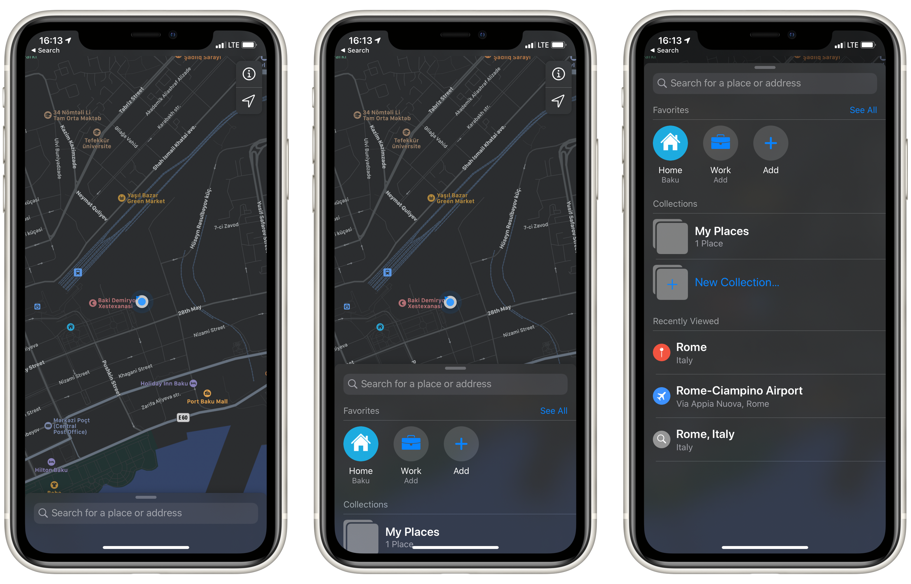
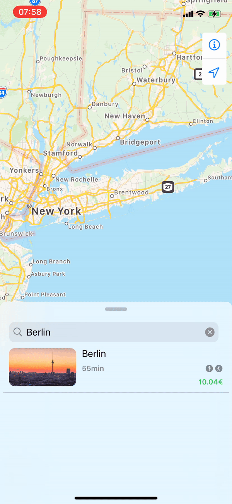

# BottomSheet

[](https://github.com/LucasMucGH/BottomSheet/releases)
[](https://github.com/LucasMucGH/BottomSheet/blob/main/LICENSE.txt)
[](https://github.com/LucasMucGH/BottomSheet/issues)

A sliding Sheet from the bottom of the Screen with 3 States build with SwiftUI

## Why

There have been many different attempts to recreate the BottomSheet from Apple Maps, Shortcuts and Apple Music, because Apple unfortunately does not provide it in their SDK.

However, all previous attempts share a common problem: The **height does not change** in the different states. Thus, the BottomSheet is always the same size (e.g. 800px) and thus remains 800px, even if you only see e.g. 400px - the rest is **inaccessible** unless you pull the BottomSheet up to the very top.

There are also many implementations out there that **only have 2 states** - **not 3** like e.g. Apple Maps.

#### Here are the benefits of my implementation:
- Dynamic height (works with `ScrollView` and **every** other view)
- Fully customizable States (**any number of states at any height**)
- Many options for **customization** (backgroundBlur, tapToDismiss, swipeToDismiss, etc.)
- Very **easy to use**
- Support for **SearchBar** in the header
- Flick through feature
- Same behavior as Apple for the `.bottom` position
- Beatuiful customizable **animations**

#### Here are some alternatives:
- https://swiftwithmajid.com/2019/12/11/building-bottom-sheet-in-swiftui/
- https://gist.github.com/mecid/78eab34d05498d6c60ae0f162bfd81ee
- https://github.com/weitieda/bottom-sheet
- https://github.com/fernandodelafuente/BottomSheetModal

#### Here you can see the states mentioned above:


#### Here you can see a preview of the BottomSheet:


## Requirements 

- iOS 13
- Swift 5.3
- Xcode 12

## Installation

The preferred way of installing BottomSheet is via the [Swift Package Manager](https://swift.org/package-manager/).

>Xcode 11 integrates with libSwiftPM to provide support for iOS, watchOS, and tvOS platforms.

1. In Xcode, open your project and navigate to **File** → **Swift Packages** → **Add Package Dependency...**
2. Paste the repository URL (`https://github.com/LucasMucGH/BottomSheet`) and click **Next**.
3. For **Rules**, select **Branch** (with branch set to `main`).
4. Click **Finish**.

## Usage

**WARNING:**
This is Sample Code for visualisation where and how to use, without a working initializer. Please see [Examples](#examples) for working code.

BottomSheet is similar to the built-in Sheet:

```swift
struct ContentView: View {

    @State var bottomSheetPosition: BottomSheetPosition = .middle //1
    
    var body: some View {
    
        Map() //2
            .bottomSheet() //3
    }
}
```

`//1` The current State of the BottomSheet.
- This is any `enum` that conforms to `CGFloat` and `CaseIterable`. For more information about custom enums see [Custom States](#custom-states).
- The following states are posible when using the predefinded `BottomSheetPosition`: `.hidden`, `.bottom`, `.middle` and `.top`.
- If you don't want the state to be changed, you can use `.constant(.middle)` (with the `.notResizeable` or `.noDragIndicator` option).

`//2` The view which the BottomSheet overlays.

`//3` This is how you add the BottomSheet - easy right?

## Parameters

### Title as Header Content

```swift
.bottomSheet(
    bottomSheetPosition: Binding<BottomSheetPosition>,
    options: [BottomSheet.Options] = [],
    title: String? = nil,
    @ViewBuilder content: () -> mContent
)
```

`bottomSheetPosition`: A binding that saves the current state of the BottomSheet.
- This can be any `enum` that conforms to `CGFloat` and `CaseIterable`. For more information about custom enums see [Custom States](#custom-states).
- The following states are posible when using the predefinded `BottomSheetPosition`: `.hidden`, `.bottom`, `.middle` and `.top`.
- If you don't want the state to be changed, you can use `.constant(.middle)` for example (should be used with the `.notResizeable` or `.noDragIndicator` option).

`options`: An array that contains the settings / options for the BottomSheet. For more information about the possible options see [Options](#options).

`title`: A string that is used as the title for the BottomSheet.
- Can be `nil`.
- You can use a view that is used as header content for the BottomSheet instead.

`content`: A view that is used as main content for the BottomSheet.

### Custom Header Content

```swift
.bottomSheet(
    bottomSheetPosition: Binding<BottomSheetPosition>,
    options: [BottomSheet.Options] = [],
    @ViewBuilder headerContent: () -> hContent?,
    @ViewBuilder mainContent: () -> mContent
)
```

`bottomSheetPosition`: A binding that saves the current state of the BottomSheet.
- This can be any `enum` that conforms to `CGFloat` and `CaseIterable`. For more information about custom enums see [Custom States](#custom-states).
- The following states are posible when using the predefinded `BottomSheetPosition`: `.hidden`, `.bottom`, `.middle` and `.top`.
- If you don't want the state to be changed, you can use `.constant(.middle)` for example (should be used with the `.notResizeable` or `.noDragIndicator` option).

`options`: An array that contains the settings / options for the BottomSheet. For more information about the possible options see [Options](#options).

`headerContent`: A view that is used as header content for the BottomSheet.
- Can be `nil`.
- You can use a string that is used as the title for the BottomSheet instead.
- Any view is possible - this can lead to problems if the view is too large. A label, a small picture or text is recommended

`mainContent`: A view that is used as main content for the BottomSheet.

### Options

`.allowContentDrag` Allows the BottomSheet to move when dragging the mainContent.

- Do not use if the mainContent is packed into a ScrollView.

`.animation(Animation)` Sets the animation for opening and closing the BottomSheet.

`.appleScrollBehavior` The mainView is packed into a ScrollView, which can only scrolled at the .top position

`.backgroundBlur` Blurs the background when pulling up the BottomSheet.

`.dragIndicatorColor(Color)` Changes the color of the drag indicator.

 `.noBottomPosition` Prevents the lowest value (above 0) from being the bottom position and hiding the mainContent.
 
 `.noDragIndicator` Hides the drag indicator.
 
 `.notResizeable` Hides the drag indicator and prevents the BottomSheet from being dragged.
 
 `.showCloseButton(action: () -> Void = {})` Shows a close button and declares an action to be performed when tapped.
 
 - If you tap on it, the BottomSheet and the keyboard always get dismissed.
 
 - If you want to do something extra, you have to declare it here.
 
 `.swipeToDismiss` Dismisses the BottomSheet when swiped down.
 
 `.tapToDissmiss` Dismisses the BottomSheet when the background is tapped.

## Custom States

 
You can create your own custom BottomSheetPosition enum:
   - The enum must be conforming to `CGFloat` and `CaseIterable`
   - The case and enum name doesnt matter
   - The case/state with `rawValue == 0` is hiding the BottomSheet
   - The value can be anythig between `0` and `1` (`x <= 1`, `x >= 0`)
   - The value is the height of the BottomSheet propotional to the screen height (`1 == 100% == full screen`)
   - The lowest value (greater than 0) automaticly gets the `.bottom` behavior. To prevent this please use the option `.noBottomPosition`

```swift
import SwiftUI

enum CustomBottomSheetPosition: CGFloat, CaseIterable {
    case top = 0.975, topMiddle = 0.7, middle = 0.4, middleBottom = 0.3, bottom = 0.125, hidden = 0
}
```

## Examples

### The simplest version of a BottomSheet

```swift
import SwiftUI
import BottomSheet

struct BottomSheetTest1: View {
    
    @State private var bottomSheetPosition: BottomSheetPosition = .middle
    
    var body: some View {
        ZStack {
            //A simple Black background
            Color.black
                .edgesIgnoringSafeArea(.all)
                
                .bottomSheet(bottomSheetPosition: self.$bottomSheetPosition) {
                    //The Numbers from 0 to 99 as Main Content in a Scroll View
                    ScrollView {
                        ForEach(0..<100) { index in
                            Text(String(index))
                        }
                        .frame(maxWidth: .infinity)
                    }
                    .padding(.top)
                }
        }
    }
}
```

### A bottom sheet for additional information

A BottomSheet that cannot be dragged, which can be closed by tapping on the background or the close button
```swift
import SwiftUI
import BottomSheet

struct BottomSheetTest2: View {
    
    @State private var bottomSheetPosition: BottomSheetPosition = .middle
    
    var body: some View {
        ZStack {
            //A simple Black background
            Color.black
                .edgesIgnoringSafeArea(.all)
                
                .bottomSheet(bottomSheetPosition: self.$bottomSheetPosition, options: [.notResizeable, .showCloseButton(), .tapToDissmiss], title: "Hello World") {
                    //A Tag, with some sample Text and a Read More and Bookmark Button
                    VStack(alignment: .leading, spacing: nil) {
                        
                        Text("BottomSheet")
                            .foregroundColor(.white)
                            .bold()
                            .padding(8)
                            .background(Color.red)
                            .cornerRadius(10)
                            .padding(.horizontal)
                        
                        Divider().padding(10)
                        
                        Text("Lorem ipsum dolor sit amet, consectetur adipiscing elit, sed do eiusmod tempor incididunt ut labore et dolore magna aliqua. Ut enim ad minim veniam, quis nostrud exercitation ullamco laboris nisi ut aliquip ex ea commodo consequat.")
                            .fixedSize(horizontal: false, vertical: true)
                            .padding(.horizontal)
                        
                        Divider().padding(10)
                        
                        HStack {
                            Button(action: {}, label: {
                                Text("Read More")
                                    .foregroundColor(.white)
                            })
                            .padding(.vertical)
                            .padding(.horizontal, 50)
                            .background(Color.black)
                            .cornerRadius(20)
                            
                            Button(action: {}, label: {
                                Image(systemName: "bookmark")
                                        .foregroundColor(.white)
                            })
                            .padding()
                            .background(Circle())
                            Spacer()
                        }
                        .padding([.horizontal, .bottom])
                        
                        Spacer()
                    }
                }
        }
    }
}
```

### A BottomSheet for Search

A BottomSheet that has a close button and a SearchBar as custorm header content
```swift
import SwiftUI
import BottomSheet

struct BottomSheetTest3: View {
    
    @State private var bottomSheetPosition: BottomSheetPosition = .middle
    @State private var searchText: String = ""
    
    var body: some View {
        //A simple Black background
        Color.black
            .edgesIgnoringSafeArea(.all)
            
            .bottomSheet(bottomSheetPosition: self.$bottomSheetPosition, options: [.showCloseButton()], headerContent: {
                //A Search Bar as Header Content
                HStack {
                    Image(systemName: "magnifyingglass")
                    TextField("Search", text: self.$searchText)
                }
                .foregroundColor(Color(UIColor.secondaryLabel))
                .padding(.vertical, 8)
                .padding(.horizontal, 5)
                .background(
                    RoundedRectangle(cornerRadius: 10)
                        .fill(Color(UIColor.quaternaryLabel))
                )
                .padding(.top, -2)
                .padding(.trailing)
            }, mainContent: {
                //The Numbers from 0 to 99 as Main Content in a Scroll View
                ScrollView {
                    ForEach(0..<100) { index in
                        Text(String(index))
                    }
                    .frame(maxWidth: .infinity)
                }
                .padding(.top)
            })
    }
}
```

### The simplest version of a BottomSheet, but with custom states

```swift
import SwiftUI
import BottomSheet

enum CustomBottomSheetPosition: CGFloat, CaseIterable {
    case top = 0.975, topMiddle = 0.7, middle = 0.4, middleBottom = 0.3, bottom = 0.125, hidden = 0
}

struct BottomSheetTest4: View {
    
    @State private var bottomSheetPosition: CustomBottomSheetPosition = .middle
    
    var body: some View {
        ZStack {
            //A simple Black background
            Color.black
                .edgesIgnoringSafeArea(.all)
                
                .bottomSheet(bottomSheetPosition: self.$bottomSheetPosition) {
                    //The Numbers from 0 to 99 as Main Content in a Scroll View
                    ScrollView {
                        ForEach(0..<100) { index in
                            Text(String(index))
                        }
                        .frame(maxWidth: .infinity)
                    }
                    .padding(.top)
                }
        }
    }
}
```

## Contributing

BottomSheet welcomes contributions in the form of GitHub issues and pull-requests.

## License

BottomSheet is available under the MIT license. See [the LICENSE file](LICENSE.txt) for more information.

## Credits

BottomSheet is a project of [@LucasMucGH](https://github.com/LucasMucGH).
